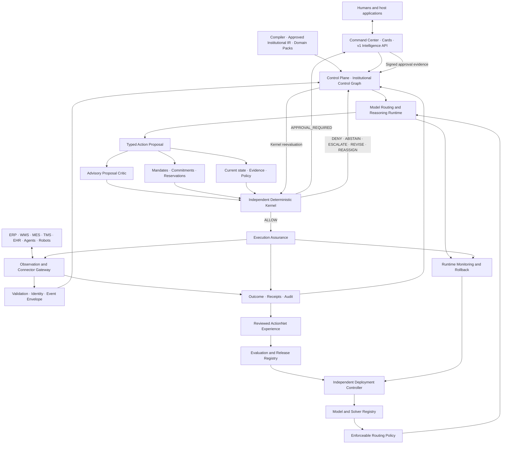

# Cerebrum Mature Platform Specification v1.0

Specification: `CEREBRUM-MATURE-PLATFORM-SPEC-001`  
Status: `FROZEN_CONTROLLING_PRODUCT_SPECIFICATION_NOT_IMPLEMENTED`  
Frozen: `2026-09-22`  
Architecture dependency: `CEREBRUM-PLATFORM-VISION-002`

This specification defines the mature Cerebrum product architecture. It does
not supersede or rewrite either frozen platform vision. It turns Vision-002
into a complete product and technical-contract map while preserving the
distinction between architecture and demonstrated capability.

> Cerebrum makes an institution computationally understandable, intelligently
> coordinated, and safely actionable.

## Complete architecture



The critic is advisory. Mandates, commitments, reservations, state, evidence,
and policy are authoritative inputs evaluated independently by the Kernel.
Critic approval cannot create authority, and critic failure cannot erase
deterministic controls.

## Five planes

### Experience plane

Command Center, embedded decision cards, v1 Intelligence API, agent interfaces,
role-specific views, approvals, appeals, corrections, evidence challenges,
halts, receipt inspection, and recovery controls share the same Control Plane.
Human approval is signed evidence for Kernel reevaluation, not permission to
bypass it.

### Observation and integration plane

Raw documents, messages, cameras, sensors, enterprise systems, agents, robots,
and human reports become Event Envelopes. The path is:

```text
Raw input
→ perception or connector normalization
→ identity and integrity validation
→ validated evidence admission
→ epistemic classification and conflict evaluation
→ versioned state projection
```

Admission never silently converts evidence into truth. The canonical epistemic
states remain `UNKNOWN`, `REPORTED`, `OBSERVED`, `INFERRED`, `DISPUTED`, and
`VERIFIED`. `UNVERIFIED` is an evidence-verification status, not a replacement
epistemic state.

### Control plane

The Control Plane contains the Institutional Control Graph, state projection,
Reasoning Runtime, Model and Solver Registry, policy/capability records,
Mandate Service, Commitment Ledger, Resource Reservation System, simulations,
provenance, receipts, and audit. Lifecycle services own their records; the
graph represents their current typed relationships under a graph version and
decision clock.

### Authority and execution plane

The Kernel uses the canonical decisions:

```text
ALLOW
DENY
ABSTAIN
ESCALATE
REVISE
REASSIGN
APPROVAL_REQUIRED
```

Expiration is a reason code, such as `MANDATE_EXPIRED`,
`RESERVATION_EXPIRED`, `APPROVAL_EXPIRED`, `EVIDENCE_EXPIRED`,
`PROPOSAL_EXPIRED`, or `CAPABILITY_QUALIFICATION_EXPIRED`. It is not a separate
Kernel decision.

Execution Assurance performs final checks, commits authorized reservations,
dispatches idempotently, records acknowledgement and partial effects,
reconciles evidence, applies registered verification policy, and proposes
separately authorized compensation when necessary. No model grants itself
authority.

### Learning and release plane

ActionNet preserves direct observations, model interpretations, simulations,
human judgments, proposals, Kernel decisions, executions, verified outcomes,
corrections, and counterfactuals as distinct record classes. Operational data
does not update production weights directly.

```text
Reviewed experience
→ rights, privacy, quality, lineage, and contamination checks
→ protected training
→ independent evaluation
→ signed release registration
→ Deployment Controller approval
→ Model and Solver Registry
→ staged routing eligibility
→ monitoring and rollback
```

## Multi-model intelligence hierarchy

| Level | Component | Responsibility |
| ---: | --- | --- |
| 1 | Perception models | propose observations from images, speech, documents, and sensors |
| 2 | Reflex models | classify, prioritize, and recommend routes rapidly |
| 3 | Compiler models | propose candidate Institutional IR |
| 4 | Cerebrum Core | reason, coordinate, request evidence, and generate plans |
| 5 | Customer and frontier models | provide qualified external capabilities |
| 6 | Domain specialists | forecast task-specific outcomes |
| 7 | Solvers and simulators | calculate feasibility and alternatives |
| 8 | Proposal critic | identify possible defects without granting authority |
| 9 | Kernel | enforce authority deterministically |
| 10 | Execution Assurance | act, monitor, reconcile, and recover |
| 11 | Outcome models | assess expected versus observed outcomes |
| 12 | Verification policy | establish official outcome status from registered evidence |
| 13 | Communication models | explain receipt-bound results without changing them |

A learned router may recommend candidates, but enforceable selection follows a
versioned routing policy over components already admitted by the independent
Deployment Controller.

## Model identity

Locally controlled models and deterministic components bind content hashes.
Provider-managed APIs that do not expose weights bind provider identity, model
identifier, API revision, deployment identifier, evaluation configuration, and
the exact routing-policy version. The registry must not fabricate an artifact
hash for inaccessible weights.

## Operating modes

| Mode | Authority boundary |
| --- | --- |
| Historical evaluation | replay only; cannot affect operations |
| Read-only shadow | live observations and non-binding recommendations |
| Human-supervised | every consequential proposal requires signed approval and Kernel reevaluation |
| Bounded autonomy | Kernel may allow registered narrow, reversible actions |
| Network coordination | coordinated proposals require each participant's local Kernel |

Every customer begins in historical evaluation, read-only shadow, or a
separately approved human-supervised mode.

## Federated coordination

Each institution retains its own Control Graph, authority records, Kernel, data
rights, and decision receipts. A network may propose plans and negotiated
commitments, but a central model cannot create a participant's commitment or
override its local Kernel. Only authorized, minimized projections and outcomes
cross institutional boundaries.

## Evidence required for a bounded institutional-intelligence claim

Cerebrum must demonstrate that it can:

1. learn institutional mechanisms beyond ordinary matched training;
2. maintain accurate temporal institutional state;
3. transfer to independently authored institutions without target retraining;
4. recognize unsupported capabilities and uncertainty;
5. gather missing information;
6. generate feasible alternatives;
7. respect policies, mandates, commitments, and resources;
8. operate through changing conditions;
9. monitor outcomes and replan;
10. produce measurable customer value;
11. reproduce results across independent training seeds; and
12. record zero observed unauthorized committed actions in the registered
    complete-system evaluation.

The final item is an evaluation gate, not proof of zero population risk.
Architecture defines the proposed system; protected evaluation determines
whether the capability exists.

## Current evidence boundary

The accurate current statement is:

> EDON has demonstrated bounded synthetic learning and limited internally
> observed transfer signals; protected independent transfer remains
> unestablished.

Reference components, schemas, synthetic evaluations, and verified-hybrid
results do not establish the mature platform, learned sustained closed-loop
operation, real-institution compiler fidelity, live connector reliability,
customer value, external replication, production safety, or bounded IGI.

## Eleven canonical specifications

1. Event Envelope
2. Institutional State Model
3. Institutional IR Lifecycle
4. Action Lifecycle
5. Institutional Control Graph
6. Delegated Authority and Commitment Layer
7. Decision, Execution, and Compensation Receipts
8. [Model Routing and Intelligence Runtime](../specifications/model-routing-intelligence-runtime.md)
9. [ActionNet Experience and Learning Contract](../specifications/actionnet-experience-learning-contract.md)
10. Release and Deployment Contract
11. First Qualified Operational Workflow

Warehouse recovery is a possible FQOW profile, not a permanent canonical
platform specification.

## Frozen doctrine

```text
Evidence enters as evidence—not truth.
Models propose observations and actions.
Compiler models propose institutional structure.
Cerebrum reasons and coordinates.
Specialists predict.
Solvers calculate.
Critics advise.
Mandates define authority.
Commitments define obligations.
Reservations prevent conflicts.
The Kernel decides.
Humans approve when required.
Execution Assurance acts.
Outcome models assess.
Verification establishes what happened.
The Control Graph updates.
Reviewed experience improves future releases.
Deployment remains independently governed.
```

## Claim boundary

This specification creates no implementation, evaluation, customer-value,
transfer, closed-loop, production-safety, deployment-authorization, IGI, or
binding-authority result. Existing experiments and frozen visions retain their
identities and content.