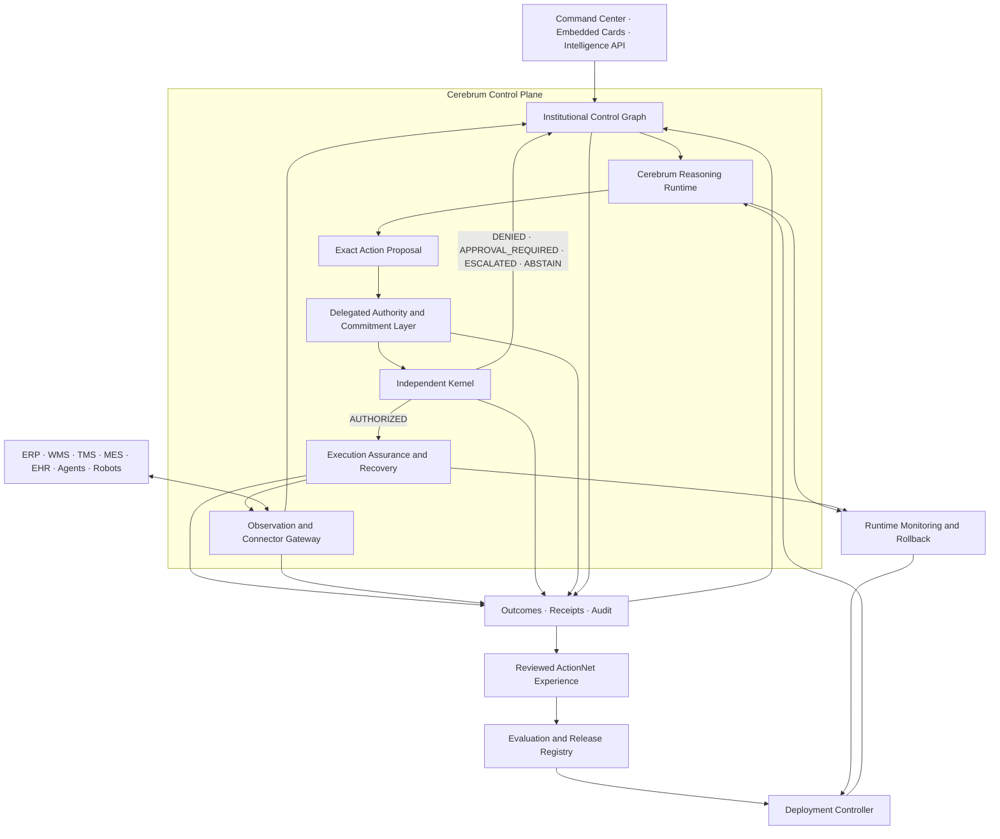

# Cerebrum platform vision 002

Protocol: `CEREBRUM-PLATFORM-VISION-002`  
Status: `FROZEN_CONTROLLING_VISION_NOT_IMPLEMENTED`  
Frozen: `2026-09-21`  
Predecessor: `CEREBRUM-PLATFORM-VISION-001`

This additive successor retains Vision-001's separation of reasoning,
authorization, execution, integration, learning, and deployment. It makes the
Control Plane more precise by introducing the Institutional Control Graph and
the Delegated Authority and Commitment Layer. It remains a platform
specification, not evidence that the complete platform is implemented,
qualified, safe for production, or authorized to bind an institution.

## Platform definition



The Evaluation and Release Registry never updates the Reasoning Runtime
directly. The Deployment Controller independently verifies the signed release,
scope, compatibility, approvals, canary, attestation, monitoring, containment,
and rollback target.

## Institutional Control Graph

The Institutional Control Graph is the versioned computational representation
of the institution. It represents:

- actors, organizations, roles, systems, facilities, and jurisdictions;
- resources, capabilities, availability, credentials, and constraints;
- evidence, observations, disputes, state assertions, and uncertainty;
- objectives, policies, prohibitions, exceptions, and approvals;
- mandates, delegations, commitments, dependencies, and reservations;
- incidents, plans, proposals, actions, receipts, outcomes, and compensation.

The graph is not an ungoverned graph database into which services write
arbitrarily. Immutable events and service-owned lifecycle records provide
custody; the graph projects their current typed relationships under a state
version and decision clock. Corrections append evidence and produce a new graph
version. Historical graph versions remain replayable.

Dedicated services manage lifecycles while their records are represented in
the graph:

```text
Commitment node in the Control Graph
        +
Commitment Ledger service manages its lifecycle
        +
Cerebrum reasons about its consequences
        +
Kernel prevents unauthorized changes
```

## Delegated Authority and Commitment Layer

This layer contains six governed services:

1. **Identity and Capability Registry:** who or what exists and what it can
   technically perform. Capability never implies permission.
2. **Mandate Service:** scoped, time-bound, revocable authority delegated by an
   accountable principal under active policy.
3. **Commitment Ledger:** promises, obligations, owners, beneficiaries,
   dependencies, deadlines, status, breach, and discharge.
4. **Resource Reservation System:** temporary or committed holds, capacity,
   conflicts, expiry, release, and consumption.
5. **Decision Receipt Service:** immutable proof of the proposal, graph version,
   evidence, mandate, policy, approvals, checks, and Kernel decision.
6. **Compensation Manager:** registered recovery after partial or failed
   execution. A compensating action is a new proposal and requires its own
   Kernel decision.

These services do not replace the Kernel. They provide typed state and evidence
for exact authorization decisions.

## Authority equation

```text
Exact proposal
+ current Control Graph version
+ active policy and jurisdiction
+ valid mandate and identity
+ fresh evidence and satisfied preconditions
+ available or reserved resources
+ required signed human approval evidence
= ALLOW | DENY | APPROVAL_REQUIRED | ESCALATE | ABSTAIN | REVISE | REASSIGN
```

Human approval creates signed approval evidence or a scoped mandate. The
Control Plane records it and requests Kernel reevaluation. Approval cannot
directly dispatch an action or broaden the proposal.

## Receipt model

Decision and execution evidence remain distinct:

- **Decision Receipt:** proves why the Kernel reached its exact decision.
- **Execution Receipt:** proves validation, reservation, dispatch,
  acknowledgement, partial effects, observed outcome, and terminal status.
- **Compensation Record:** proves why recovery was proposed and authorized and
  what effect the compensating action produced.

A delivery acknowledgement is not proof of completion, and completion is not
proof of a verified beneficial outcome. Receipts are nodes in the Control Graph
and immutable audit artifacts managed by their responsible services.

## Product surfaces

### Intelligence API

Applications, models, and agents may submit observations, request assessments
and plans, submit action proposals, inspect commitments and reservations,
retrieve authorization decisions and receipts, request authorization-bound
execution, and report outcomes. No public endpoint allows a caller to declare
authorization, mandate validity, successful execution, or verified outcome.

### Control Plane

The Control Plane contains the Institutional Control Graph, Reasoning Runtime,
Delegated Authority and Commitment Layer, independent Kernel, Execution
Assurance and Recovery, connector/outcome infrastructure, audit stream, and
learning/release controls.

### Command Center

Humans inspect state, compare plans, create or revoke scoped mandates, monitor
commitments, resolve evidence disputes, review resource conflicts, approve when
required, challenge recommendations, halt execution, inspect receipts, and
manage compensation and recovery.

## Canonical specifications

Vision-002 inherits Vision-001's six specifications unchanged:

1. Event Envelope
2. Institutional State Model
3. Institutional IR Lifecycle
4. Action Lifecycle
5. Release and Deployment Contract
6. First Qualified Operational Workflow

It adds:

7. [Institutional Control Graph](../specifications/institutional-control-graph.md)
8. [Delegated Authority and Commitment Layer](../specifications/delegated-authority-commitment.md)
9. [Decision, Execution, and Compensation Receipts](../specifications/decision-execution-receipts.md)

## Smallest pilot slice

The first pilot implements only the graph objects, services, connectors, and
receipts required for one registered workflow:

```text
Observation
→ graph update
→ affected objective or commitment
→ assessment and exact proposal
→ mandate, evidence, policy, and reservation checks
→ Kernel decision and Decision Receipt
→ shadow result or authorization-bound execution
→ Execution Receipt
→ verified outcome and graph update
→ compensation when required
```

Everything outside that workflow remains unsupported until separately
qualified.

## Complete doctrine

```text
The Control Graph represents the institution.
Cerebrum understands and coordinates it.
The Mandate Layer defines who may bind it.
The Kernel enforces its authority.
Execution Assurance acts and verifies.
Outcomes update the graph.
Decision Receipts prove what occurred.
Reviewed experience improves future releases.
The Deployment Controller governs installation.
Humans retain ultimate control.
```

## Compatibility and claim boundary

- Vision-001 remains frozen as the predecessor and is not rewritten.
- Existing experiments, results, hashes, C1 identities, five-view state
  contracts, Kernel tokens, outbox records, and `/api/*` routes retain their
  historical meaning.
- The Control Graph and new services are target components, not re-labels that
  upgrade current reference code.
- No complete Control Graph, mandate service, commitment ledger, reservation
  system, receipt service, compensation manager, or production Deployment
  Controller is currently established by this specification.
- This vision creates no scientific, customer-value, production-safety,
  mini-IGI, transfer, or binding-authority result.

## Positioning

> Cerebrum is the institutional intelligence platform for governed autonomy.
> Its Control Graph makes the institution computational; its intelligence
> coordinates the institution; and its authority system ensures that people,
> agents, and machines act within human-defined mandates.