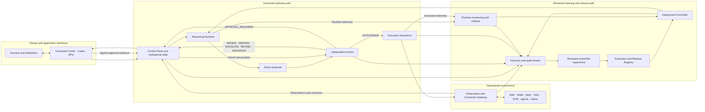

# Cerebrum platform vision

Protocol: `CEREBRUM-PLATFORM-VISION-001`  
Status: `FROZEN_CONTROLLING_VISION_NOT_IMPLEMENTED`  
Frozen: `2026-09-20`

This document defines EDON's controlling product architecture. It is an
intended architecture, not evidence that the complete platform exists, has
passed protected evaluation, is production safe, or may exercise institutional
authority. Existing reference components and historical experiments retain
their recorded status and terminology.

## Platform definition

Cerebrum is one horizontal institutional-intelligence platform with multiple
interfaces. The horizontal core remains constant; each deployment adds a
bounded domain pack and qualifies a specific operational workflow.



## Frozen doctrine

```text
Models propose.
Humans approve when required.
Kernel authorizes.
Execution Assurance acts.
Connectors interact.
Outcomes update state.
Reviewed evidence improves future releases.
```

A human approval is evidence supplied to the Kernel. It cannot bypass Kernel
reevaluation. A successful evaluation is evidence supplied to deployment
governance. It cannot bypass the Deployment Controller or human release
approval.

## Component boundaries

| Component | Responsibility | Authority |
| --- | --- | --- |
| Experience layer | Command Center, embedded decision cards, APIs, SDKs, webhooks, and governed agent access | interaction only |
| Control Plane | authoritative institutional state, commitments, objectives, resources, incidents, policy versions, and orchestration | state custody under registered rules |
| Reasoning Runtime | assessment, planning, simulation, uncertainty, information requests, and action proposals | none |
| Independent Kernel | evaluates identity, evidence, policy, authority, jurisdiction, conflicts, risk, resources, and approvals | authorization decisions only |
| Execution Assurance | validates an existing authorization against current state, reserves resources, dispatches, reconciles, and compensates | acts only within exact authorization |
| Observation and Connector Gateway | normalizes inbound evidence and performs approved connector interactions | cannot mint or broaden authorization |
| ActionNet | captures reviewed experience and constructs governed training candidates | no online weight or deployment authority |
| Evaluation and Release Registry | binds artifacts, evaluations, capabilities, limitations, and rollback targets | release evidence only |
| Deployment Controller | verifies signed release compatibility, scope, approval, canary, attestation, containment, and rollback | installs approved releases within scope |
| Runtime monitoring | detects threshold violations and requests containment or rollback | no policy-bypass authority |
| Domain pack | domain IR extensions, mappings, policies, solvers, actions, evaluations, and operator views | bounded by its qualified capability envelope |

## Public API boundary

The public interface is an institutional-task API, not a generic model endpoint.
Its canonical resources are:

```text
POST /v1/observations
POST /v1/incidents
POST /v1/assessments
POST /v1/plans
POST /v1/simulations
POST /v1/action-proposals

GET  /v1/authorization-decisions/{id}
POST /v1/executions

GET  /v1/executions/{id}
GET  /v1/commitments
GET  /v1/institutional-state
GET  /v1/audit-records/{id}
```

No public endpoint permits a caller to declare an action authorized. An
execution request must bind an unchanged action proposal, an unexpired Kernel
decision, the expected current state version, an approved connector, and an
idempotency key. Execution Assurance rechecks all conditions before acting.

## Canonical specifications

1. [Event Envelope](../specifications/event-envelope.md)
2. [Institutional State Model](../specifications/institutional-state-model.md)
3. [Institutional IR Lifecycle](../specifications/institutional-ir-lifecycle.md)
4. [Action Lifecycle](../specifications/action-lifecycle.md)
5. [Release and Deployment Contract](../specifications/release-deployment-contract.md)
6. [First Qualified Operational Workflow](../specifications/first-qualified-operational-workflow.md)

## Domain-pack rule

```text
Core Cerebrum platform
+ domain-specific IR
+ connector mappings
+ Kernel policies
+ capability envelope
+ evaluation suite
+ operator interface
= qualified deployment
```

The first deployment domain is selected by evidence opportunity, not by a
permanent platform identity. Logistics is a reasonable tie-breaker, but a
committed healthcare, manufacturing, data-center, energy, retail, construction,
or other partner may provide stronger first evidence. Higher-risk domains must
begin with bounded operational coordination rather than autonomous expert
judgment.

## Compatibility and claim boundary

- Historical `CEREBRUM-*`, C1, Kernel-token, experiment, evaluation, manifest,
  hash, and result records are not rewritten.
- Existing `/api/*` routes remain internal reference interfaces until a
  separately implemented and tested `/v1` facade exists.
- Existing state schemas remain v1 compatibility contracts. The canonical
  state model is additive and multidimensional.
- The current repository contains partial reference components; it does not
  contain the complete Control Plane, Execution Assurance, Deployment
  Controller, public v1 API, production Command Center, or qualified domain
  deployment.
- This vision does not pass Program-005, Matched-001, transfer, closed-loop,
  customer-value, mini-IGI, production-safety, or external-validation gates.

## Positioning

> Keep your proprietary models, agents, and operating systems. Cerebrum turns
> them into one coordinated, accountable institution.

> Models propose. Institutions decide. Cerebrum makes the complete process
> computational, governed, and auditable.