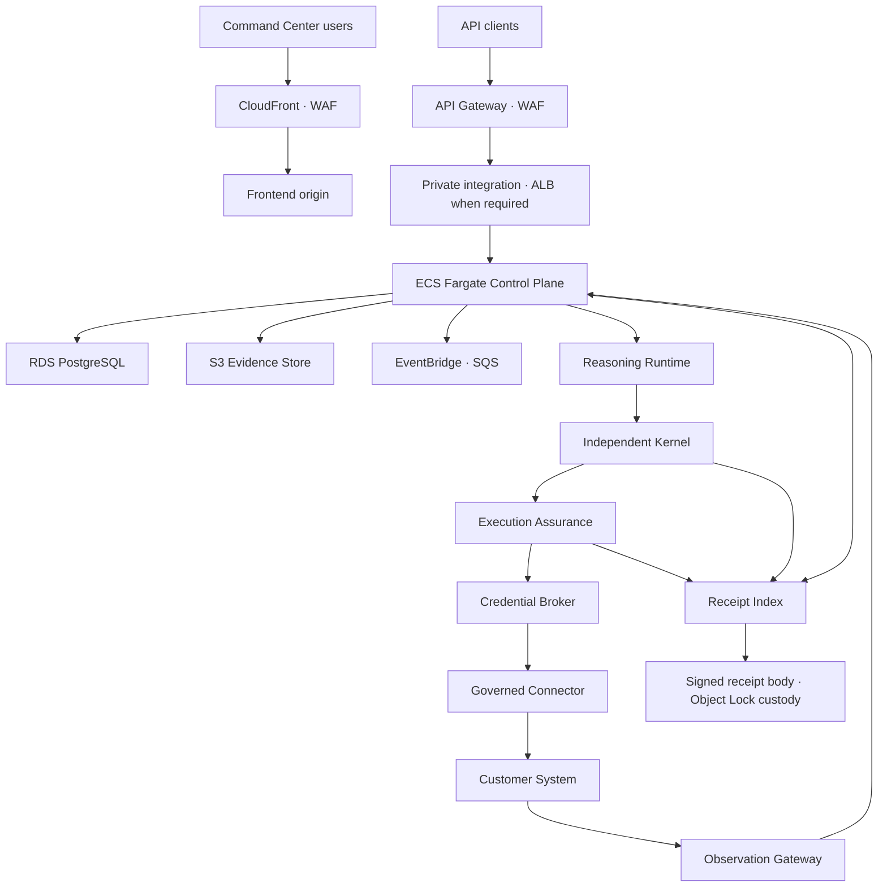

# Cerebrum AWS Deployment Profile 001

Profile: `CEREBRUM-AWS-DEPLOYMENT-PROFILE-001`  
Status: `DRAFT_REFERENCE_DEPLOYMENT_NOT_PRODUCTION_QUALIFIED`  
Drafted: `2026-09-23`  
Foundation dependency: `CEREBRUM-PLATFORM-FOUNDATION-001`  
Architecture dependency: `CEREBRUM-MATURE-PLATFORM-SPEC-001`

This profile maps the vendor-neutral Platform Foundation to a proposed first
AWS deployment. It is replaceable: an Azure, Google Cloud, private-cloud, or
on-premises profile may satisfy the same Foundation requirements without
changing Cerebrum's frozen doctrine.

The initial AWS strategy is managed-service first, PostgreSQL first, and no
Kubernetes unless measured scale or deployment constraints later justify it.

## Proposed service mapping

| Platform responsibility | Proposed AWS service |
| --- | --- |
| DNS and certificates | Route 53 and AWS Certificate Manager |
| Command Center delivery | CloudFront with an appropriate frontend origin |
| Firewall and attack protection | AWS WAF and Shield Standard |
| Public API entry | API Gateway |
| Private container ingress | Application Load Balancer or API Gateway VPC Link as required |
| CPU backend containers | ECS Fargate |
| Short bounded background jobs | Lambda |
| Durable workflows | Step Functions Standard |
| Transactional database | RDS for PostgreSQL Multi-AZ |
| Initial Control Graph | relational PostgreSQL nodes, edges, versions, and indexes |
| Optional semantic retrieval | `pgvector` under governed data-access rules |
| Evidence and documents | Amazon S3 |
| Authoritative receipt bodies | separate-account S3 bucket with Object Lock and controlled retention mode |
| Event routing | EventBridge |
| Reliable work queues | SQS with dead-letter queues |
| Optional cache | ElastiCache for Redis only when measured need exists |
| Initial customer identity | Cognito behind an EDON identity abstraction |
| Advanced enterprise identity | separately qualified enterprise SSO/SCIM provider when required |
| Workforce identity | IAM Identity Center |
| Application authorization primitives | Amazon Verified Permissions/Cedar or qualified OPA deployment |
| Encryption keys and signing | AWS KMS |
| Secrets | AWS Secrets Manager |
| AWS temporary credentials | AWS STS |
| External-system credential exchange | connector-specific OAuth, federation, certificates, token exchange, or broker integration |
| CPU model services | controlled ECS Fargate services where appropriate |
| GPU model services | SageMaker endpoints, Bedrock, AWS Batch, or ECS on GPU-backed EC2 capacity |
| Container images | Amazon ECR |
| Infrastructure provisioning | Terraform or OpenTofu |
| Source control | GitHub |
| Build and deployment | GitHub Actions using AWS OIDC and short-lived roles |
| Logs and metrics | CloudWatch |
| Distributed tracing | OpenTelemetry with AWS X-Ray where useful |
| Threat and posture monitoring | GuardDuty and Security Hub |
| Vulnerability scanning | Inspector |
| Sensitive-data discovery | Macie where applicable |
| Infrastructure audit | CloudTrail and AWS Config |
| Backups | AWS Backup and RDS point-in-time recovery |
| Operator alerting | qualified paging service connected to monitored alarms |

Fargate is not the proposed GPU runtime. GPU inference requires a service that
actually exposes qualified accelerator capacity. STS secures AWS resource
access; it does not replace connector-specific credentials for customer ERP,
WMS, TMS, EHR, robotics, or other external systems.

## Delivery topology

Keep static/web delivery and API delivery independently evolvable.



CloudFront, API Gateway, and an Application Load Balancer should not be placed
in every request path by default. Each layer must have a specific delivery,
security, protocol, or private-network purpose.

## Application technologies

The initial practical preference is:

```text
Next.js and TypeScript Command Center
NestJS Control Plane
Python reasoning and model workers
Go deterministic Kernel
PostgreSQL canonical state
Step Functions durable orchestration
ECS Fargate CPU deployment
SageMaker, Bedrock, Batch, or ECS-on-EC2 for qualified GPU workloads
```

JSON Schema and OpenAPI remain the public and storage-contract baseline.
Protobuf may be introduced for measured high-volume internal paths. Database
migrations use one controlled migration system per owning service. Tests include
unit, integration, authorization, tenant-isolation, contract, replay,
restoration, and browser workflow coverage.

Cedar or OPA may implement access-control primitives. Neither replaces the
institutional Kernel, its seven decision classes, or proposal-bound authority.

## Six AWS deployables

### Gateway and Identity

- CloudFront and WAF for the Command Center edge;
- API Gateway and WAF for public APIs;
- Cognito or a separately qualified enterprise identity provider;
- tenant-context validation, rate limits, and application authorization;
- verified `tenant_id`, principal, principal type, roles/capabilities,
  request ID, and trace ID on every admitted request.

### Control Plane

An ECS Fargate application containing bounded modules for institutional state,
Control Graph, incidents, mandates, commitments, reservations, approvals, and
proposals. It may read qualified customer observations but possesses no
customer-system write credentials.

### Reasoning Runtime

Separately deployed Python services using ECS, SageMaker, Bedrock, Batch, or
qualified external providers. It receives a temporary purpose-bound context,
invokes only registered tools, and returns typed proposals. It cannot mutate
canonical institutional state or operational systems directly.

### Independent Kernel

A separately deployable deterministic service, preferably Go for the first
production implementation, with versioned policy, exact state/proposal inputs,
signed decisions, restricted deployment permissions, and no execution
credentials or model-generated code execution.

### Execution and Connectors

Step Functions may orchestrate approval waits, reservation checks, credential
requests, dispatch, acknowledgements, timeouts, verification, cancellation,
and separately authorized compensation. The Credential Broker uses a distinct
service identity and key boundary. Connectors accept only authorization-bound,
short-lived grants and emit outcomes back through the Observation Gateway.

### Operations and Release

GitHub Actions, ECR, infrastructure as code, the Model and Solver Registry,
Release Registry, independent Deployment Controller, CloudWatch/OpenTelemetry,
security monitoring, containment, and rollback automation. Evaluation creates
a qualified candidate; only an authorized deployment transaction makes it
routable.

## PostgreSQL profile

Use one RDS PostgreSQL cluster initially only if risk, performance, and customer
requirements permit it. Maintain explicit schemas and database roles:

```text
identity
institutional_state
control_graph
governance
commitments
proposals
kernel
execution
outcomes
release_registry
receipt_index
```

Required controls include row-level tenant enforcement, separate read/write
roles, forced service-mediated state changes, no model database credentials,
append-only authorization history, Multi-AZ where required, point-in-time
recovery, and tested restoration. Schema separation is an ownership mechanism,
not by itself a complete security boundary; higher-risk customers may require
separate databases, accounts, or keys.

## Receipt custody

Use two coordinated records:

1. searchable receipt metadata and indexes in PostgreSQL; and
2. the canonical serialized and signed receipt body in a separately controlled
   S3 Object Lock bucket.

Each authoritative receipt should be canonically serialized, content hashed,
signed through an approved KMS asymmetric key or equivalent signer, linked to
its predecessor where applicable, stored under an immutable identifier, and
corrected only through supersession.

Object Lock governance mode can be bypassed by specially authorized identities;
compliance mode prevents protected-object deletion during the retention period
but creates substantial operational consequences. Retention mode, legal hold,
key custody, account separation, replication, and break-glass policy require
explicit approval and testing before production use.

## Account structure

```text
AWS Organization
├── Management
├── Security
├── Log Archive
├── Development
├── Staging
├── Production
└── Customer-dedicated accounts when required
```

Production data must not be copied casually into development. Use synthetic,
contractually permitted, or explicitly de-identified fixtures under recorded
data-rights and retention controls.

## Customer connectivity

Initial read-only pilots may use customer REST APIs, secure file delivery to a
dedicated landing zone, approved database replicas or exports, site-to-site
VPN, PrivateLink where supported, read-only service accounts, and
customer-specific connector workers.

Future write paths remain:

```text
Kernel ALLOW decision
→ Execution Assurance current-state recheck
→ Credential Broker
→ proposal- and authorization-bound temporary grant
→ Governed Connector
→ Customer System
→ Observation Gateway
→ admitted outcome evidence and state projection
```

Secrets Manager prevents embedding managed secrets in source or images, but it
does not by itself make a credential proposal-bound. The Credential Broker and
connector must enforce the exact authorization scope, state version,
expiration, and idempotency rules.

## Healthcare and regulated workloads

AWS infrastructure does not itself make EDON HIPAA compliant or qualified for a
clinical workflow. Before processing protected health information, EDON must
execute the required agreement, confirm every used service is currently
eligible, configure the services correctly, complete its own privacy and
security controls, and qualify the exact workflow. Healthcare pilots should
begin with operational coordination rather than autonomous clinical judgment.

Service eligibility and compliance-program scope are time-sensitive and must
be reverified against current AWS documentation and the customer agreement at
deployment review.

## Deferred infrastructure

Do not introduce without measured need:

- Kubernetes/EKS;
- Kafka/MSK;
- Neo4j or another dedicated graph database;
- self-hosted identity, PostgreSQL, Vault, or monitoring stacks;
- active-active global regions;
- hundreds of Lambda functions;
- broad autonomous production writes;
- a connector marketplace or hundreds of connectors;
- cross-institution federation; or
- custom commodity infrastructure that does not differentiate EDON.

## Non-contractual cost planning

The following are illustrative planning envelopes only. They are not quotes,
budgets, commitments, or evidence that the stated architecture fits within the
range.

| Environment | Illustrative monthly envelope excluding heavy inference |
| --- | ---: |
| Development | `$300–$1,000` |
| Staging | `$500–$1,500` |
| First secure shadow pilot | `$2,000–$6,000` |
| Multi-AZ early production | `$5,000–$15,000` |
| Model inference | separate and workload dependent |

Before approval, replace these ranges with a dated bill of materials and
calculator model covering region, uptime, requests, CPU/memory, database class
and storage, backups, logs, NAT/network paths, data transfer, security services,
receipt retention, and model traffic. Actual AWS rates and service behavior
must be rechecked at approval time.

## Profile qualification gates

This profile remains unqualified until:

1. its mapping satisfies every Platform Foundation freeze gate;
2. the architecture is threat modeled and reviewed;
3. account, network, identity, key, secret, and receipt trust boundaries are
   deployed as designed;
4. tenant isolation and authorization tests pass;
5. backup and point-in-time restoration exercises pass;
6. Object Lock mode and receipt verification are tested;
7. model, Control Plane, Kernel, Execution Assurance, Broker, and connector
   credentials are demonstrably separated;
8. evaluation cannot bypass deployment approval;
9. GPU and external-model routes are separately qualified;
10. the First Qualified Operational Workflow completes historical replay and
    read-only shadow operation;
11. costs and SLOs are measured; and
12. any applicable customer, privacy, security, regulatory, and contractual
    reviews are complete.

## Claim boundary

This profile records a proposed AWS implementation. It creates no AWS account,
deployed service, executed business associate agreement, compliance status,
security certification, customer commitment, production SLO, workflow
qualification, authority to process regulated data, or permission for
consequential writes.

## Primary AWS references

- [AWS HIPAA compliance](https://aws.amazon.com/compliance/hipaa-compliance/)
- [AWS HIPAA eligible services reference](https://aws.amazon.com/compliance/hipaa-eligible-services-reference/)
- [Amazon ECS Fargate task definitions](https://docs.aws.amazon.com/AmazonECS/latest/developerguide/fargate-tasks-services.html)
- [Amazon S3 Object Lock](https://docs.aws.amazon.com/AmazonS3/latest/userguide/object-lock.html)
- [AWS STS temporary credentials](https://docs.aws.amazon.com/IAM/latest/UserGuide/id_credentials_temp.html)
- [AWS Secrets Manager](https://docs.aws.amazon.com/secretsmanager/latest/userguide/intro.html)

These references are informative and must be rechecked when the profile is
approved or deployed.