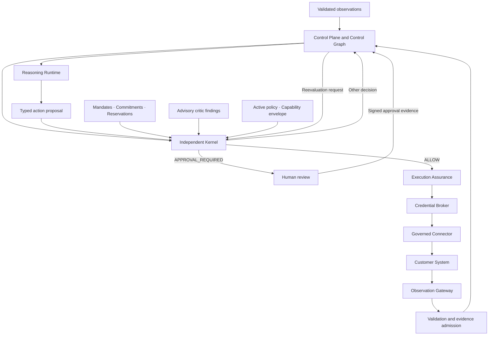

# Cerebrum Platform Foundation 001

Specification: `CEREBRUM-PLATFORM-FOUNDATION-001`  
Status: `DRAFT_IMPLEMENTATION_SPECIFICATION_NOT_DEPLOYMENT_AUTHORIZATION`  
Drafted: `2026-09-23`  
Architecture dependency: `CEREBRUM-MATURE-PLATFORM-SPEC-001`

This specification defines the vendor-neutral operational foundation for the
first trustworthy Cerebrum implementation. It refines the frozen mature
platform specification without changing its authority doctrine, authorizing a
deployment, or asserting that the described controls have been implemented.

```text
Mature Platform Specification → what Cerebrum is
Platform Foundation           → how a trustworthy implementation must run
Qualified Operational Workflow → whether it produces bounded customer value
```

## Corrected production path



The Kernel independently evaluates the exact proposal, current state and
evidence, active policy, mandates and signed approvals, commitments, resource
reservations, actor capability, and advisory critic findings. Critic approval
cannot create authority. Human approval supplies evidence for reevaluation and
cannot bypass the Kernel.

Outcomes never mutate institutional state directly. They return through the
Observation Gateway, validation, evidence admission, epistemic classification,
conflict handling, and versioned state projection.

## Logical service boundaries

| Service | Responsibility |
| --- | --- |
| API Gateway | authentication, rate limits, routing, request validation, and API versioning |
| Identity and Tenant Service | humans, organizations, agents, services, roles, attributes, and tenant context |
| Observation and Connector Gateway | controlled intake from enterprise systems, agents, robots, files, and human reports |
| Event Validation Service | signatures, schemas, timestamps, identities, replay protection, trust classification, and evidence admission |
| Control Plane Backend | incidents, state projection, commitments, plans, approvals, and human workflows |
| Institutional Control Graph | canonical typed relationships among actors, resources, evidence, authority, obligations, plans, and outcomes |
| Reasoning Runtime | qualified model, solver, simulation, and critic invocation through enforceable routing policy |
| Model and Solver Registry | approved identities, versions, capabilities, permissions, budgets, evaluations, and deployment status |
| Proposal Service | stores plans and exact typed proposals without granting authority |
| Independent Kernel | deterministic evaluation of policy, state, evidence, mandates, constraints, and required approvals |
| Approval Service | signed human decisions returned as evidence for Kernel reevaluation |
| Execution Assurance | final validation, reservations, credential requests, dispatch, acknowledgement, verification, and recovery |
| Credential Broker | short-lived, proposal-bound credential issuance after a valid Kernel authorization |
| Decision Receipt Service | authoritative records binding evidence, state, proposal, model, policy, authority, execution, and outcome |
| Outcome Service | admitted outcome evidence, verification policy, reconciliation, and state projection |
| Evaluation and Release Registry | protected evaluation and signed qualification of release candidates |
| Deployment Controller | independently approved installation, canarying, attestation, containment, and rollback |
| Monitoring and Incident Service | availability, latency, faults, security events, rollback signals, and operator alerts |

These are logical trust and ownership boundaries. They are not a requirement to
deploy a separate network service for every row.

## Six initial deployables

| Deployable | Included responsibilities |
| --- | --- |
| Gateway and Identity | API gateway, SSO, tenants, principals, access policy, request validation, and observation admission |
| Control Plane | state, Control Graph, incidents, mandates, commitments, reservations, proposals, and approvals |
| Reasoning Runtime | model routing, context construction, simulation, solvers, critics, and typed proposals |
| Independent Kernel | deterministic policy and authorization decisions under an independently deployable identity |
| Execution and Connectors | Execution Assurance, connector workers, outcome intake, verification, and recovery |
| Operations and Release | registries, Deployment Controller, authoritative receipt custody, telemetry, containment, and rollback |

The first implementation should prefer a modular monolith and a small number of
deployables over an early microservice network. Shared infrastructure does not
remove module, process, database-role, service-identity, or credential
boundaries. The Credential Broker must use a distinct security principal and
signing boundary even if it initially shares a deployment environment with
Execution Assurance.

## Data foundation

The first pilot should minimize database diversity.

| Storage | Purpose |
| --- | --- |
| PostgreSQL | tenants, identities, incidents, versioned state, graph nodes and edges, policies, commitments, proposals, approvals, and searchable receipt indexes |
| Object storage | original evidence, documents, exports, evaluation artifacts, and signed releases |
| Durable queue or event bus | connector events, background work, retries, and outcome notifications |
| Append-only receipt custody | authoritative decision, authorization, execution, compensation, and security records |
| Optional cache | short-lived locks, rate limits, expiring reservations, and derived views |
| Optional governed vector index | semantic retrieval constrained by tenant, purpose, sensitivity, and provenance |

The initial Control Graph may use relational tables such as:

```text
control_nodes
control_edges
state_versions
evidence_records
commitments
mandates
reservations
action_proposals
authorization_decisions
executions
outcomes
decision_receipts
```

A dedicated graph database is deferred until measured traversal complexity,
latency, and operating cost demonstrate that PostgreSQL is inadequate.

## Canonical data rules

```text
Raw event
→ immutable evidence record
→ identity, integrity, schema, and time validation
→ evidence admission and epistemic classification
→ versioned state projection
→ typed proposal
→ Kernel decision
→ human review or shadow disposition
→ receipt, observed outcome, and verification
```

- Raw evidence is never overwritten.
- Corrections create linked versions or superseding records.
- State is projected from admitted evidence and remains distinguishable from
  reports, inference, dispute, and verification.
- Models cannot write directly to institutional state or customer systems.
- Every consequential operation binds tenant, actor, trace, state, evidence,
  policy, proposal, and authorization versions.
- Kernel reevaluation and credential issuance recheck authorization expiry,
  proposal identity, current state, reservations, connector qualification, and
  idempotency immediately before dispatch.

## Credential isolation

```text
Reasoning Runtime → no customer credentials
Control Plane     → no customer write credentials
Kernel            → no execution credentials
Execution Assurance → requests an authorization-bound credential
Credential Broker → issues the minimum short-lived credential
Governed Connector → performs only the authorized operation
```

Every issued credential or credential grant must bind:

```text
tenant
connector
action
resource
proposal_id and proposal_hash
authorization_id and decision_hash
expected_state_version
maximum scope
expiration
idempotency key
```

Use, expiry, revocation, state mismatch, proposal change, or authorization
change invalidates reuse. Cloud-native temporary credentials cover only the
relevant cloud resources; customer systems require their own qualified OAuth,
federation, token-exchange, certificate, or broker mechanism.

## Receipts and telemetry

Operational telemetry and authoritative receipts are separate record classes.

| Operational telemetry | Authoritative receipts |
| --- | --- |
| logs, metrics, and traces | decision, authorization, execution, compensation, and outcome records |
| diagnostic purpose | institutional proof and reconstruction |
| may be sampled | cannot be sampled |
| ordinary operational retention | policy-controlled authoritative retention |
| wider engineering access | strict need-to-know access |
| not authoritative | bound to exact state, evidence, policy, proposal, approval, artifact, and outcome versions |

Receipts require canonical serialization, immutable identifiers, signatures,
hash linkage where applicable, correction by supersession, and a documented
verification procedure. Tamper evidence must define how chains are checked and
how an independently controlled anchor or equivalent custody boundary prevents
an operator from rewriting both a receipt and its local history.

## Independent release and deployment

```text
Reviewed ActionNet release
→ protected evaluation
→ signed qualified candidate in the Release Registry
→ authorized deployment approval
→ independent Deployment Controller
→ Model and Solver Registry
→ enforceable routing eligibility
→ runtime monitoring, containment, and rollback
```

Evaluation cannot install a component. The Reasoning Runtime cannot qualify or
promote one. The Deployment Controller verifies artifact identity, evaluation
results, workflow qualification, capability and data-access envelopes,
compatible platform/domain-pack/connector versions, approved tenant and
workflow scope, canary limits, runtime attestation, monitoring thresholds, and
rollback target.

## Security foundation

- customer SSO through SAML or OIDC and mandatory MFA for privileged roles;
- separate identities for humans, services, agents, models, connectors, and
  deployment automation;
- role- and attribute-based authorization with immediate revocation;
- encryption in transit and at rest with managed keys;
- secrets in a managed secret system, never in source or container images;
- tenant identity on every governed record plus enforced database and service
  isolation;
- separate development, staging, and production data and credentials;
- purpose-bound, minimized model context with sensitivity, jurisdiction,
  retention, and prohibited-use limits;
- explicit tool allowlists, network egress controls, time/cost limits, schema
  validation, invocation receipts, and kill switches;
- protected branches, peer review, infrastructure as code, signed builds,
  dependency/container/secret scanning, software bills of materials, staged
  deployment, incident response, and independent testing before write access.

## Reliability foundation

- idempotency keys and replay protection;
- durable queues, retry ceilings, dead-letter handling, and circuit breakers;
- health checks and safe degraded modes;
- automated backups, point-in-time recovery, and restoration exercises;
- documented recovery-time and recovery-point objectives;
- no silent event loss;
- complete receipt generation for every consequential decision;
- tenant-isolation and authorization regression tests;
- customer-specific business-continuity and connector-failure procedures.

## Proposed pilot SLOs

These are non-contractual engineering targets until measured, load tested,
restoration tested, connector analyzed, and negotiated with the design partner.

```text
PROPOSED_PILOT_SLO
Availability target: 99.9%
Recovery-time target: ≤4 hours
Recovery-point target: ≤15 minutes
Event-loss target: zero silent loss
Receipt-generation target: 100%
Cross-tenant access tolerance: zero
```

## Freeze gates

Foundation-001 remains draft until all of the following have evidence:

1. service ownership and trust boundaries are documented;
2. database ownership, record authority, and data classifications are defined;
3. Kernel inputs, outputs, reason codes, version binding, and decision clocks
   have canonical schemas;
4. human approval and Kernel reevaluation are tested end to end;
5. write credentials are isolated from models, the Control Plane, and Kernel;
6. receipt canonicalization, integrity, verification, anchoring, and
   supersession are tested;
7. evaluation results cannot bypass deployment approval;
8. backup restoration and point-in-time recovery succeed in staging;
9. tenant-isolation, authorization, revocation, and confused-deputy tests pass;
10. pilot SLOs are measured rather than assumed;
11. threat modeling, privacy review, security review, and incident procedures
    are complete;
12. the First Qualified Operational Workflow traverses the complete historical
    replay and read-only shadow path;
13. outcome evidence returns only through the governed observation path; and
14. current-state and authorization checks occur immediately before credential
    issuance and dispatch.

## Claim and authority boundary

This draft specifies implementation requirements only. It does not establish a
working production system, security certification, regulatory compliance,
customer qualification, service level, scientific result, deployment approval,
binding authority, or permission for consequential connector writes.